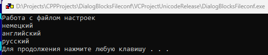
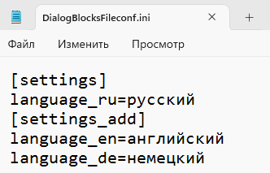

# DialogBlocksFileсonf
Пример консольной программы работы с файлом настроек на C++ с использованием wxWidgets и DialogBlocks в Visual Studio 2022





```
#include <wx/wx.h>
#include <wx/fileconf.h>
#include <wx/stdpaths.h>
#include <wx/filename.h>
#include <locale>
#include <memory>

#ifdef __WXMSW__
#include <fcntl.h>
#include <io.h>
#endif

class MyApp : public wxApp {
private:
    wxLocale m_locale; // Держим локаль в объекте класса
public:
    virtual bool OnInit() override {
        // Устанавливаем локаль для Unicode
        setlocale(LC_ALL, "ru_RU.UTF-8");
        m_locale.Init(wxLANGUAGE_RUSSIAN, wxLOCALE_DONT_LOAD_DEFAULT);

        wxPuts(L"Работа с файлом настроек");

        // Создаем имя файла конфигурации
        wxFileName fn(wxStandardPaths::Get().GetExecutablePath());
        fn.SetExt("ini");

        // Создаем объект конфигурации
        auto m_fileconfig = std::make_unique<wxFileConfig>(
            wxEmptyString, wxEmptyString, fn.GetFullPath(), wxEmptyString,
            wxCONFIG_USE_LOCAL_FILE | wxCONFIG_USE_NO_ESCAPE_CHARACTERS
        );

        wxConfigBase::Set(m_fileconfig.get());

        wxConfigBase* conf = wxConfigBase::Get(false);
        if (!conf) {
            wxPuts(L"Ошибка: объект конфигурации не создан!");
            return false;
        }

        conf->SetPath(L"/settings");
        conf->Write(L"language_ru", L"русский");

        conf->SetPath(L"/settings_add");
        conf->Write(L"language_en", L"английский");
        conf->Write(L"language_de", L"немецкий");

        wxPuts(conf->Read(L"language_de", L"de ?"));
        wxPuts(conf->Read(L"language_en", L"en ?"));

        conf->SetPath(L"/settings");
        wxPuts(conf->Read(L"language_ru", L"ru ?"));

        m_fileconfig->Flush(); // Сохраняем настройки

        wxConfigBase::Set(nullptr); // Очищаем объект конфигурации

        // Ожидание ввода без использования system()
        wxPuts(L"Нажмите Enter для выхода...");
        std::wcin.get();

        return false; // Завершаем приложение
    }
};

// Определяем точку входа вручную
wxIMPLEMENT_APP_NO_MAIN(MyApp);

int main(int argc, char** argv) {
    wxInitializer initializer;
    if (!initializer.IsOk()) {
        wxPuts(L"Ошибка: wxWidgets не инициализирован!");
        return -1;
    }
    return wxEntry(argc, argv);
}
```

## Ссылки:

http://www.anthemion.co.uk/dialogblocks/

***Бесплатная лицензия на DialogBlocks:*** https://github.com/proffix4/dialogblocks_free

https://www.wxwidgets.org/

https://visualstudio.microsoft.com/ru/vs/community/

http://www.anthemion.co.uk/dialogblocks/ImageBlocks-1.07-Setup.exe
